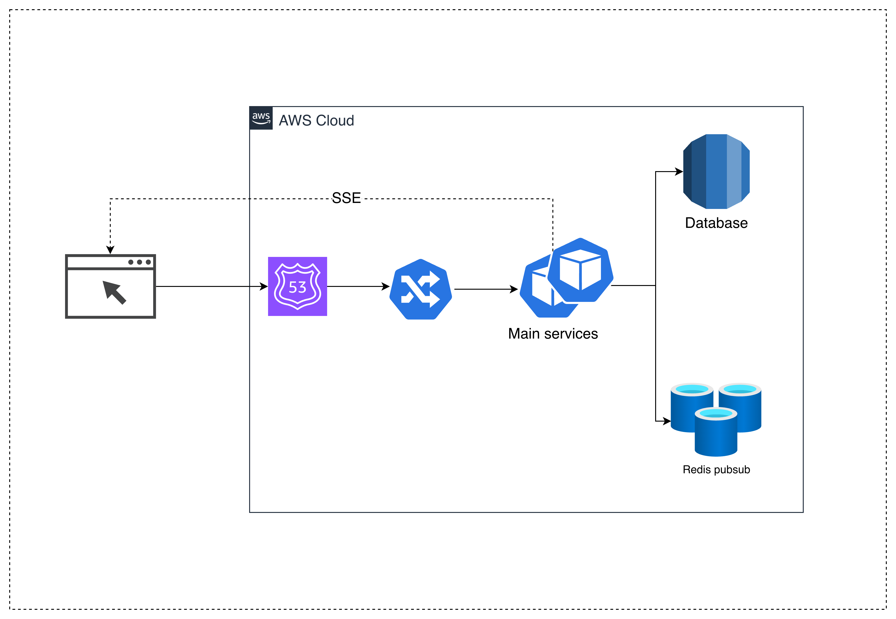
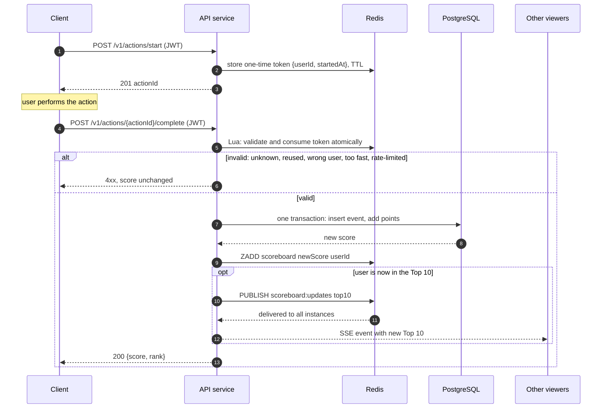
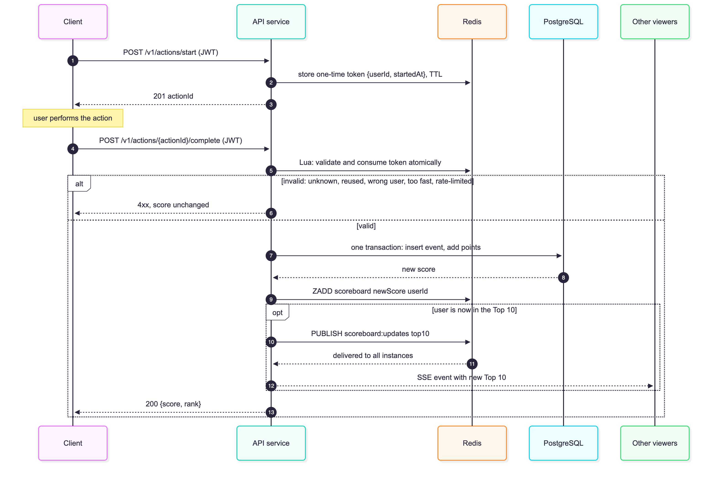

# Scoreboard Module — System Design Proposal

> **Scope of this proposal.** This document is a design proposal **focused only on the leaderboard feature** (score recording, Top 10, live updates, abuse prevention). It is one module of a larger API service, not a design of the whole system.
>
> **Assumed to already exist, and out of scope here:**
> - **Authentication and authorization module:** login, registration, and issuing/validating JWTs. This module only consumes the validated `userId`.
> - **User data:** a `users` table (and its management) already exists. This module only references `users.id`.
> - Existing platform pieces: API service, load balancer, PostgreSQL, Redis, deployment pipeline.
>
> Anything outside the leaderboard is mentioned only where this module depends on it.

## 1. Executive Summary

The website shows a live Top 10 scoreboard. Users earn points by completing an action, and the client reports completion to the API service. This module records the points, serves the Top 10, pushes changes to viewers in near real time, and ensures a score can only increase through a legitimate completion.

**Value:** a trustworthy leaderboard (users cannot forge scores) that updates live, with an architecture that starts simple and scales without changing the API.

**Key design decision:** the client never sends a score. The server grants a fixed number of points, and only for a completion it authorised in advance through a one-time, user-bound token.

## 2. Background & Problem Statement

- **Current state:** the website has a scoreboard. Score updates are an API call from the client after an action completes.
- **Problem 1 — trust:** a naive endpoint such as `POST /score {userId, points}` can be called by anyone, including with a forged score. Authentication alone does not fix this, because any logged-in user can still craft the request.
- **Problem 2 — freshness:** users expect the board to change without refreshing the page.
- **Problem 3 — load:** many viewers read the same Top 10, while a smaller number of users write scores. Reads must not hit the primary database each time.

## 3. Goals & Scope

### 3.1 Goals (derived from the requirements)

| # | Requirement | Goal |
|---|-------------|------|
| R1 | Show the top 10 scores | Serve a correct Top 10 quickly to any number of viewers |
| R2 | Live updates | Viewers see changes within about a second, without refreshing |
| R3 | Completing an action increases the user's score | Each completed action adds points to exactly that user |
| R4 | Completion dispatches an API call | One authenticated endpoint receives the completion |
| R5 | Prevent unauthorised score increases | A score only increases through a server-authorised completion, exactly once |

### 3.2 Non-goals

- What the action is, or how the client performs it (stated as out of scope).
- The auth module and the `users` table: login, registration, JWT issuing, user management. They already exist (see the scope note at the top); we consume them.
- Proving the action was really performed. The server cannot observe it, so we limit abuse instead (see Security in §4.1 and §5).
- Frontend rendering of the board.
- Periodic leaderboards, rewards, user profiles, anti-fraud ML.

### 3.3 Assumptions and scale tiers

The requirements give no numbers, so the design is sized for three scenarios. **The API contract is identical in all three**; only the infrastructure behind it changes. The design target is **Medium**.

| | Small | **Medium (target)** | Large |
|---|---|---|---|
| Registered users | up to 10k | up to ~1M | tens of millions |
| Completions per second (peak) | < 10 | 100 – 1,000 | 10,000+ |
| Concurrent viewers | < 1k | ~10k | 100k – 1M |

Other assumptions: points per action are fixed (`POINTS_PER_ACTION`); the board is all-time; the existing auth module validates the JWT and exposes the caller's `userId` to this module; the `users` table already exists, so this module creates only `user_scores` and `score_events` and references `users.id`; clients are untrusted; about one second of board delay is acceptable.

## 4. Technical Approach & Design

## 4.1 High-Level Design

### Component design



**Components shown in the diagram**

| Component | Role |
|-----------|------|
| Browser | Calls `start` / `complete`, reads the board, and keeps one SSE connection open for live updates |
| Route 53 | DNS only. Resolves the API domain to the load balancer. No request or SSE data passes through it |
| Load balancer / Ingress | Single entry point. Distributes requests across the Main service instances and also carries the long-lived SSE connections |
| Main services (N instances) | Stateless API service, scaled horizontally. Instances share no memory, all shared state lives in Redis and the database |
| Database (PostgreSQL on RDS) | Source of truth for scores and the append-only audit log |
| Redis (ElastiCache) | Labelled "pubsub" in the diagram, but it holds four things: one-time action tokens, rate-limit counters, the Top 10 sorted set, and the pub/sub channel |

**Modules inside each Main service instance**

| Module | Responsibility |
|--------|----------------|
| Auth + rate-limit middleware | Validates the JWT, extracts `userId`, applies per-user and per-IP limits |
| Action service | Issues a one-time action token (`start`); validates and consumes it (`complete`) |
| Score service | Adds points and writes the audit event in one DB transaction; updates the Redis cache |
| Scoreboard service | Reads the Top 10 from Redis; rebuilds it from PostgreSQL on a cache miss |
| Stream gateway | Holds the SSE connections of this instance; forwards Top 10 changes received over Redis pub/sub |

**How to read the diagram (notes)**

1. **Solid arrows** are network connections opened by the browser or by a service.
2. **The dashed "SSE" arrow is a logical channel, not a separate network path.** The browser opens one ordinary HTTP connection to `GET /v1/scoreboard/stream`, and it goes through Route 53 (DNS) and the load balancer like any other request. The service keeps that connection open and streams Top 10 updates back on it. The dashed line only shows the direction of the data: server to browser.
3. **Route 53 is not on the data path.** It resolves the domain once; after that the browser talks to the load balancer directly.
4. **Simplification:** the arrows from the Main services to the database and Redis are drawn one-way. In reality Redis is two-way, because every instance both publishes Top 10 changes and subscribes to them, so each instance can forward them to its own SSE clients.
5. **Why Redis pub/sub is needed:** a score is written through instance A, but the viewers who must be notified may be connected to instances B to N. Pub/sub carries the change to every instance.
6. **SSE needs load balancer tuning:** the idle timeout must be longer than the heartbeat interval (see the API contract), and no proxy may buffer the response.

### Flow design



Viewers connect once to `GET /v1/scoreboard/stream`, receive the current Top 10, then one message per change.

### Technology choices

| Concern | Choice | Alternatives considered | Why |
|---------|--------|------------------------|-----|
| Who decides points | Server, fixed value | Client sends `+N` | Only way to meet R5 |
| Authorising a completion | Two-step: server-issued one-time token | Authenticated `POST /score` alone; client-signed request | Plain auth lets any user forge completions; a client-held secret can be extracted from the page. A server-issued token is user-bound, expiring and single-use |
| Source of truth | PostgreSQL | Redis only | Scores must survive cache loss and be auditable |
| Top 10 read | Redis sorted set | `ORDER BY score DESC LIMIT 10` per request | Fine at small scale, too hot at medium and above |
| Live updates | SSE | Polling; WebSocket | Traffic is one-way. SSE is plain HTTP and reconnects automatically. Polling wastes load and lags. WebSocket adds cost for a capability we do not need |
| When to push | Only when the user enters or moves within the Top 10 | On every score change | Most scoring users are outside the Top 10, so most pushes would be noise |

### Performance, scalability, availability

| | Small | **Medium** | Large |
|---|---|---|---|
| API | 1 instance | N stateless instances behind a load balancer | Autoscaled |
| Tokens, rate limits | PostgreSQL table | Redis | Redis cluster |
| Top 10 | Indexed SQL query | Redis sorted set | Redis plus a CDN-cached snapshot (1 s TTL) for reads |
| Writes | Direct to PostgreSQL | Direct to PostgreSQL | Queue (Kafka/SQS), batched into PostgreSQL; Redis gives the real-time view |
| Live push | In-process or `LISTEN/NOTIFY` | SSE, fan-out via Redis pub/sub | Dedicated stream tier or managed pub/sub; throttle pushes to 1–2 per second |
| Main bottleneck | None meaningful | PostgreSQL write rate | Fan-out cost, hot Redis key |

- **Cost of the two-step flow:** each action costs two requests instead of one. `start` is a single O(1) Redis write with no database access, so the real bottleneck (the PostgreSQL write) still happens once per action. At large scale, `start` can issue an HMAC-signed token with no storage.
- **Availability:** API instances are stateless. If Redis fails, reads fall back to PostgreSQL and scoring pauses; no accepted score is lost because PostgreSQL is authoritative. A Redis replica gives failover. In-flight tokens are lost on a Redis restart, so users simply restart the action.
- **Start small:** the Small tier is a subset of Medium (PostgreSQL in place of Redis), so a time-boxed build can start there and upgrade without changing the API.

### Security

| Threat | Mitigation |
|--------|------------|
| Call the API without logging in | JWT required on both write endpoints; `userId` comes only from the JWT, never from the body |
| Send an arbitrary score | There is no score field; points are a server constant |
| Replay a captured completion | Token is single-use and consumed atomically; the DB primary key rejects duplicates |
| Use someone else's `actionId` | Token is bound to the user who started it |
| Script mass completions | Per-user and per-IP rate limits, minimum action duration, optional daily points cap |
| Tamper with history | Audit log is append-only; the API's DB role cannot update or delete events |
| Abuse of the public stream | Cap SSE connections per IP; expose display name only |

**Honest limit:** a script can still call `start`, wait out the minimum duration, then call `complete`; it looks like a real user. Closing that requires server-side verification of the action, which is a non-goal. Limits and caps bound the damage; the audit log supports detection.

## 4.2 Low-Level Design

### Database (PostgreSQL)

```sql
CREATE TABLE user_scores (
  user_id    UUID        PRIMARY KEY REFERENCES users(id),
  score      BIGINT      NOT NULL DEFAULT 0 CHECK (score >= 0),
  updated_at TIMESTAMPTZ NOT NULL DEFAULT now()
);
CREATE INDEX idx_user_scores_score ON user_scores (score DESC);

CREATE TABLE score_events (               -- append-only audit log
  id         UUID        PRIMARY KEY,     -- = actionId; duplicate insert fails
  user_id    UUID        NOT NULL REFERENCES users(id),
  points     INT         NOT NULL,
  ip         INET,
  created_at TIMESTAMPTZ NOT NULL DEFAULT now()
);
CREATE INDEX idx_score_events_user_time ON score_events (user_id, created_at DESC);
```

Applying a score (one transaction):

```sql
INSERT INTO score_events (id, user_id, points, ip) VALUES (:actionId, :userId, :points, :ip);
INSERT INTO user_scores (user_id, score) VALUES (:userId, :points)
  ON CONFLICT (user_id) DO UPDATE
  SET score = user_scores.score + :points, updated_at = now()
  RETURNING score;
```

### Redis

| Key / channel | Type | Content | TTL |
|---------------|------|---------|-----|
| `action:{actionId}` | hash | `userId`, `startedAt` | `ACTION_TOKEN_TTL` (default 10 min) |
| `scoreboard` | sorted set | member `userId`, score = total score | none; rebuilt from PostgreSQL on a miss |
| `rl:{userId}:{window}` | counter | requests in the window | window length |
| `scoreboard:updates` | pub/sub channel | JSON of the new Top 10 | n/a |

Atomic validate-and-consume (Lua, one round trip): read `action:{id}`; if missing → `NOT_FOUND`; if `userId` differs → `FORBIDDEN`; if `now - startedAt < MIN_ACTION_DURATION_MS` → `TOO_FAST` (token kept); otherwise delete the key and return `OK`. Deleting inside the same script is what guarantees that two concurrent completions cannot both succeed.

`ZADD` uses the absolute score returned by PostgreSQL, so it is idempotent: a retry or a reconciliation job can safely re-run it.

### API contract

Base path `/v1`. Auth: `Authorization: Bearer <JWT>`. All errors use `{ "error": { "code": "...", "message": "..." } }`.

**`POST /v1/actions/start`** (auth) — empty body.

```json
201 { "actionId": "7b9f...-uuid", "expiresAt": "2026-10-03T12:10:00Z" }
```
Errors: `401 UNAUTHENTICATED`, `429 RATE_LIMITED`.

**`POST /v1/actions/{actionId}/complete`** (auth) — empty body. Path `actionId` must be a UUID.

```json
200 { "score": 1250, "rank": 7 }
```

| Status | Code | Meaning |
|--------|------|---------|
| 401 | `UNAUTHENTICATED` | Missing or invalid JWT |
| 403 | `FORBIDDEN` | Token belongs to another user |
| 404 | `NOT_FOUND` | Unknown or expired `actionId` |
| 409 | `ALREADY_USED` | Token already consumed (a retry gets the current score, never a second increment) |
| 422 | `TOO_FAST` | Completed before `MIN_ACTION_DURATION_MS`; token is kept so the client can retry |
| 429 | `RATE_LIMITED` | Limit exceeded |

**`GET /v1/scoreboard`** (public)

```json
200 { "updatedAt": "2026-10-03T12:00:00Z",
      "top10": [ { "rank": 1, "userId": "...", "displayName": "Ann", "score": 5000 } ] }
```

**`GET /v1/scoreboard/stream`** (public, `text/event-stream`)

```
event: scoreboard
data: {"updatedAt":"...","top10":[...]}
```
The first event is the current Top 10; later events are sent on change. Every event carries the full Top 10, so a reconnecting client needs no replay. A comment heartbeat is sent every 15–30 s.

### Configuration (no hard-coded values)

`POINTS_PER_ACTION` (10), `ACTION_TOKEN_TTL` (10 min), `MIN_ACTION_DURATION_MS` (1000), per-user rate limit (e.g. 30 `start`/min), optional `DAILY_POINTS_CAP`.

### Test checklist

Concurrent double completion of one `actionId` (exactly one succeeds); wrong user; expired token; too fast then retry; Redis loss and cache rebuild; SSE reconnect; Top 10 push only when membership or order changes.

## 5. Risks & Mitigations

| Risk | Impact | Mitigation |
|------|--------|-----------|
| Scripted completions that respect the timing rules | Inflated scores | Rate limits, daily cap, anomaly detection on `score_events`; long term, server-side verification |
| Redis outage | Scoring paused; board may be stale | PostgreSQL authoritative; replica failover; rebuild the sorted set on recovery |
| Redis update fails after the DB commit | Board briefly stale | `ZADD` with absolute score is idempotent; periodic reconciliation from PostgreSQL |
| PostgreSQL write rate becomes the limit | Slower `complete` | Move to queue-based batched writes (Large tier) |
| Many SSE viewers | Memory and fan-out cost | Per-IP connection caps, throttle pushes to 1–2 per second, dedicated stream tier |
| Token store holds stale entries | Memory growth | TTL on every token key |
| Ties in score | Ambiguous ranking | Define a tie-break (earlier `updated_at` wins), encoded in the sorted-set score |
| Extra `start` call per action | Higher request count | `start` is O(1) in Redis; HMAC-signed tokens at large scale |

## 6. Suggested Improvements

1. **Server-side verification of the action** if it ever becomes observable. The only complete fix for scripted cheating.
2. **Anomaly detection and review tooling** built on the audit log (flag growth far above the median, shadow-ban).
3. **Periodic leaderboards** (daily, weekly) as extra sorted sets, if the product wants them.
4. **Observability:** metrics for completions, rejections by reason, push latency, SSE connections. A spike in rejections is the main attack signal.
5. **Privacy:** the public board exposes display name only.
6. **Session-token variant:** a join-time token plus an increasing nonce removes the `start` call but loses the minimum-duration check. Not chosen because it protects less for a small saving.
